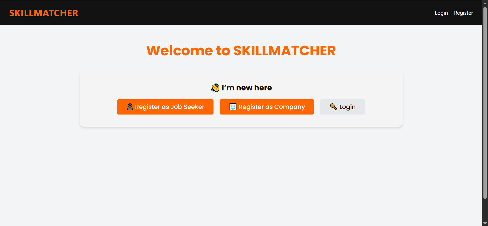
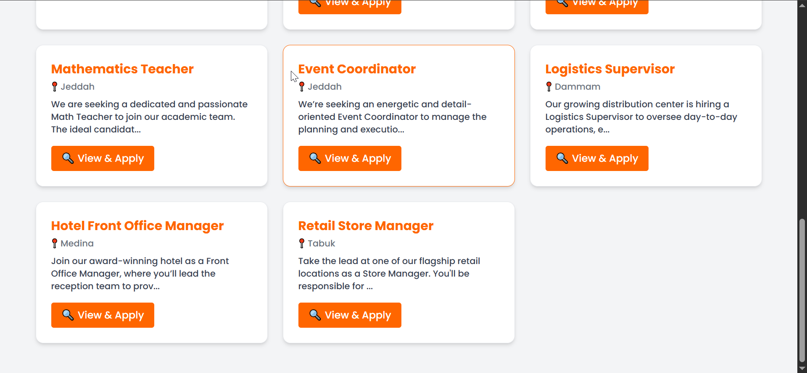
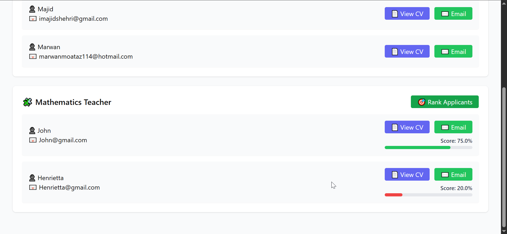
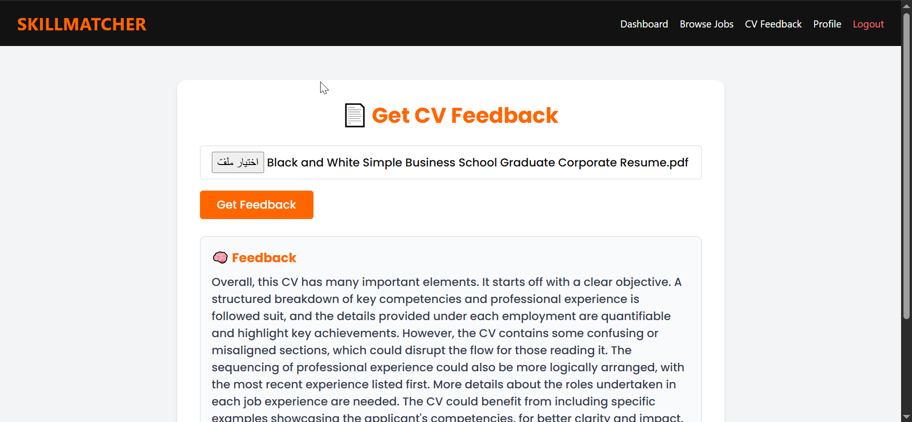

# SkillMatcher - Job Matching Platform

A full-stack web application that connects job seekers with companies through an intelligent job matching system, featuring AI-powered CV feedback and automated candidate ranking.

## 📸 Screenshots

### Home Page

### Job Listings

### Applicants Ranking

### CV Feedback

## 🎯 Project Overview

This platform serves as a bridge between job seekers and employers, providing:
- A seamless job application process with CV uploads
- AI-powered feedback to help job seekers improve their resumes
- Intelligent candidate matching to help companies find the best applicants
- A modern, responsive user interface for both user types

## 🚀 Key Features

### For Job Seekers
- **Browse Job Listings**: Explore available positions posted by companies
- **Apply with CV**: Upload your CV directly when applying for jobs
- **AI CV Feedback**: Get personalized, constructive feedback on your resume using OpenAI GPT-4
- **Track Applications**: Monitor the status of your job applications
- **User Profile**: Manage your profile and application history

### For Companies
- **Post Jobs**: Create and manage job postings with detailed descriptions
- **Review Applications**: View all applications for your posted positions
- **Smart Candidate Ranking**: Automatically rank applicants based on job requirements and CV content
- **Application Management**: Accept or reject applications with status tracking

### Technical Features
- **Dual Authentication System**: Separate registration and login for job seekers and companies
- **JWT Token Authentication**: Secure API access with JSON Web Tokens
- **RESTful API**: Complete backend API for frontend integration
- **PDF Processing**: Automated text extraction and parsing from CV PDFs
- **AI Integration**: OpenAI GPT-4 integration for intelligent CV analysis
- **Responsive Design**: Modern React frontend with Tailwind CSS

## 🛠️ Tech Stack

### Backend
- Django 5.1.5
- Django REST Framework
- JWT Authentication
- PyMuPDF & PyPDF2
- OpenAI API

### Frontend
- React 19.1.0
- React Router DOM
- Tailwind CSS

## 🔄 Workflow

**Job Seeker Flow:**
- Register → Browse Jobs → Apply with CV → Get Feedback → Track Status

**Company Flow:**
- Register → Post Job → Receive Applications → View Rankings → Manage Status

